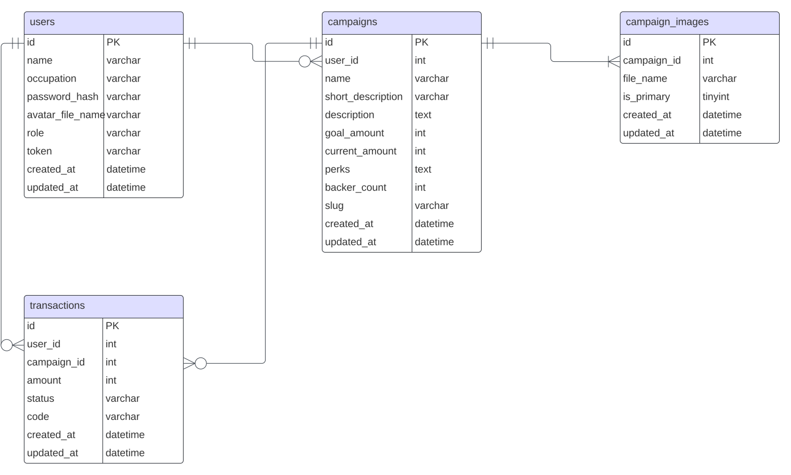

# Crowdfunding

## Description:

Crowdfunding is a way of raising money to finance projects or business. This project was inspired by [KitaBisa](https://kitabisa.com/). Feel free to try this API.

## Tech Stack:

* Go
* Gin
* GORM
* Validator
* MySQL
* JWT-Authorization
* 3rd Party APIs (Midtrans)
* REST

## ERD



## List Route

## API Route
### Users
- **`POST` - `api/v1/users`**, Create new user
- **`POST` - `api/v1/sessions`**, Login user
- **`POST` - `api/v1/email_checkers`**, Check user's email wheter it is registered or not
- **`POST` - `api/v1/avatars`**, Upload user's avatar

### Campaigns
- **`GET` - `api/v1/campaigns`**, Get all campaigns
- **`GET` - `api/v1/campaigns/:id`**, Get detail campaign by id
- **`POST` - `api/v1/campaigns`**, Create campaign
- **`PUT` - `api/v1/campaigns/:id`**, Update campaign
- **`POST` - `api/v1/campaigns-images`**, Update campaign's image

### Transactions
- **`GET` - `api/v1/campaigns/:id/transactions`**, Get the transaction data from the campaign based on its id
- **`GET` - `api/v1/transactions`**, Get the transaction data from users who make transactions
- **`POST` - `api/v1/transactions`**, Create transaction

## CMS Route
### Users
- **`GET` - `/users`**, Get all users
- **`GET` - `/users/new`**, New user form route
- **`POST` - `/users`**, New user form submit
- **`GET` - `/users/edit/:id`**, Edit user form route
- **`POST` - `/users/update/:id`**, Edit user form submit
- **`GET` - `/users/avatar/:id`**, New user's avatar form route
- **`POST` - `/users/avatar/:id`**, New user's avatar form submit

### Campaigns
- **`GET` - `/campaigns`**, Get all campaigns
- **`GET` - `/campaigns/new`**, New campaign form route
- **`POST` - `/campaigns`**, New campaign form submit
- **`GET` - `/campaigns/image/:id`**, New campaign's image form route
- **`POST` - `/campaigns/image/:id`**, New campaign's image form submit
- **`GET` - `/campaigns/edit/:id`**, Edit campaign's image form route
- **`POST` - `/campaigns/update/:id`**, Edit campaign's image form submit
- **`GET` - `/campaigns/show/:id`**, Get campaign detail

### Transactions
- **`GET` - `/transactions`**, Get all transactions

### Sessions
- **`GET` - `/login`**, Login form
- **`POST` - `/session`**, Login user (only admin role can do log in)
- **`GET` - `/logout`**, Logout user

## Run Locally

Clone the project

```bash
  git clone https://github.com/gustionusamba24/crowdfunding-backend.git
```

Go to the project directory

```bash
  cd my-project
```

Install dependencies

```bash
  go get
```

Start the server

```bash
  go run main.go
```


